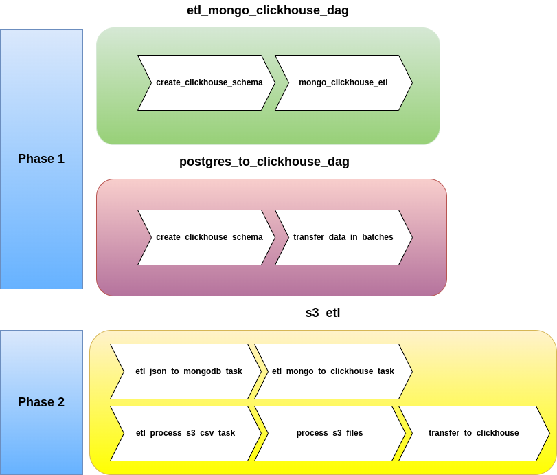

# Airflow DAGs

## Overview
This repository contains Apache Airflow DAGs that transfer data from MongoDB to ClickHouse and PostgreSQL to ClickHouse. The DAGs consist of tasks for creating the schema, performing data extraction, loading, and additional processing steps.

## Requirements
- Docker and Docker Compose

## Phase 1

### MongoDB to ClickHouse DAG

**Tasks:**
1. **Create ClickHouse Schema**: This task creates the necessary database and table schema in ClickHouse. It sets up a schema named `bronze` and a table `videos`.
    - Uses the `create_clickhouse_schema` function.

2. **Extract and Load Data**: This task queries MongoDB for data using batch processing and loads the data into ClickHouse. It inserts documents into the `bronze.videos` table, ensuring that each document's fields are correctly formatted and inserted.
    - Uses the `mongo_clickhouse_etl` function.

**Default Arguments:**
- **Owner**: airflow
- **Start Date**: 2023-01-01
- **Retries**: 1

**Schedule Interval:**
The DAG is scheduled to run once (`@once`).

### PostgreSQL to ClickHouse DAG

**Tasks:**
1. **Transfer Data in Batches**: This task transfers data from PostgreSQL to ClickHouse in batches.
    - Uses the `transfer_data_in_batches` function.

**Default Arguments:**
- **Owner**: airflow
- **Depends on Past**: False
- **Email on Failure**: False
- **Email on Retry**: False

**Schedule Interval:**
This DAG is not scheduled (`schedule_interval=None`) and can be triggered manually as needed.

**Start Date:**
The DAG starts from one day ago.

## Phase 2

### DAG Details

**Tasks:**
1. **ETL JSON to MongoDB**: This task extracts data from JSON files stored in S3 and loads it into MongoDB.
    - Uses the `etl_json_to_mongodb` function with `db_name` set to `videos` and `collection_name` set to `videos`.

2. **ETL MongoDB to ClickHouse**: This task extracts data from MongoDB and loads it into ClickHouse.
    - Uses the `etl_mongo_to_clickhouse` function with `db_name` set to `videos` and `collection_name` set to `videos`.

3. **ETL CSV to Postgres**: This task creates a tracking table for CSV files processing.
    - Uses the `create_tracking_table` function.

4. **Process S3 Files**: This task processes CSV files from S3 and loads them into a Postgres database.
    - Uses the `process_csv_files` function.

5. **Transfer Data to ClickHouse**: This task transfers data from Postgres to ClickHouse in batches.
    - Uses the `transfer_data_in_batches` function.

6. **Backfilling and Incremental Processing**: This task sets up backfilling and incremental data processing mechanisms to handle historical data and ongoing updates.
    - Uses the respective functions and logic for backfilling and incremental processing.

**Default Arguments:**
- **Owner**: airflow
- **Catchup**: True
- **Retries**: 1
- **Retry Delay**: 5 minutes
- **On Failure Callback**: `notify_on_failure`
- **On Success Callback**: `notify_on_success`
- **On Retry Callback**: `notify_on_retry`

**Schedule Interval:**
The DAG is scheduled to run daily at 7 PM (`0 19 * * *`).

### Variables

- `mongo_batch_size`: Specifies the batch size for reading data from MongoDB. Defaults to `1000`.
- `BATCH_SIZE_POSTGRES`: Specifies the batch size for reading data from PostgreSQL. Defaults to `10000`.

## Usage

1. Ensure that your Docker environment is set up and the necessary services are running using Docker Compose:
    ```sh
    docker-compose up
    ```
2. Wait for the Docker Compose services (Airflow webserver, scheduler, etc.) to be fully up and running.
3. Place the DAG file in your Airflow DAGs folder.
4. Access the Airflow web interface at `http://localhost:9090`.
5. Trigger the DAG manually or wait for the scheduled run.

## Notes

- Ensure that your Airflow connections are properly set up for MongoDB (`MONGO_CONN_ID`) and ClickHouse.
- Adjust the included packages or settings based on your environment and requirements.

